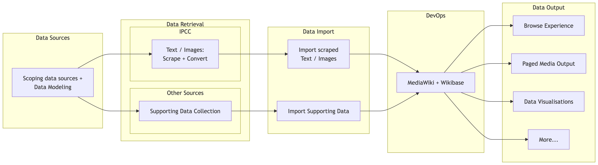
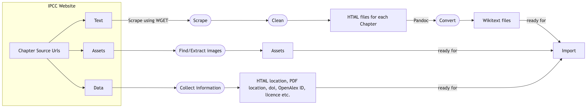
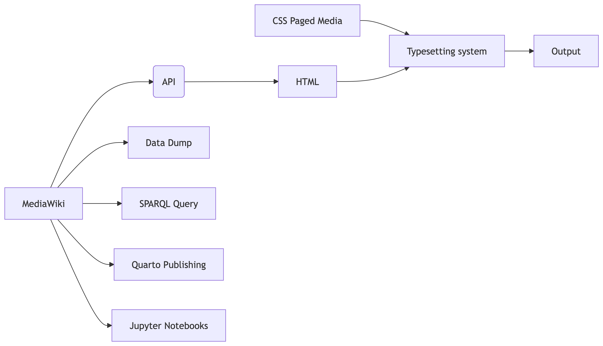

## About ClimateKG {.smaller}

- Climate Knowledge Graph (ClimateKG) is a yearlong R&D project to create a knowledge graph of the IPCC Sixth Assement Report (AR6). The project has been funded by TIB Innovation Fund and is made in cooperation with #semanticClimate community (India, Germany, UK, and more).   
- The ClimateKG knowledge graph is built using Wikibase and MediaWiki. 
- The goal is to be a resource for data scientists, for citizen science activities, and to distribute data to Wikidata.

---

## Source Material: What is the IPCC Report? {.smaller}

> It is a survival guide for humanity. As it shows, the 1.5-degree limit is achievable. - [UN Secretary-General António Guterres](https://media.un.org/avlibrary/en/asset/d302/d3022200#:~:text=In%20a%20video%20message%20to,1.5%2Ddegree%20limit%20is%20achievable) (2023)

- A multilateral panel of 195 nations that reviews the global scientific literature to map out climate scenarios for the next 100 years combining science, policy, and politics.
- AR6 ( $\approx$ 5-8 year cycle since 1988): 932 authors; 7 Reports; >8 million words; 10,047 pages; 48,400 citations; 66,834 data sets; 2,136 images; 1,910 Acronyms; 920 Glossary items; 5 languages+ (partial).* 

::: aside
\* Oldenbourg, Laura, and Simon Worthington. "IPCC AR6 Quantification Summary". Climate Knowledge Graph, November 4, 2025. [10.5281/zenodo.17521936](https://doi.org/10.5281/zenodo.17521936).
:::

## Problem: For the public to trust climate science it has as open {.smaller}

::::: columns
::: {.column width="50%"}
- **Headline issues:**
  - Search and SEO limited
  - Not easy to reuse
  - Formats of Web CMS HTML and PDF not suitable for data science
  - Referenced materials not interlinked - so only manual tracking to find a named data set, etc
  - Parts not easily available - Methodology, Supplementary material

:::

::: {.column width="50%"}
- **Examples:**
  - Links only to top levels: Reports, Glossary website, Author listing website etc.
  - Glossary terms have no links to reports
  - Author lists have no link to chapters
  - Figures listed on web pages with no DOIs
  - Citations on websites and not research repositories

:::
:::::

::: aside
Example IPCC sites: [Reports](https://www.ipcc.ch/assessment-report/ar6/); [Authors](https://apps.ipcc.ch/report/authors/); [Glossary](https://apps.ipcc.ch/glossary/); [Figures and Citations example WGIII](https://www.ipcc.ch/report/ar6/wg3/).
:::

---

## Solution: Apply the vision of the Semantic Web 🕸️ 

> Link all of the parts and make machine readable — AKA a Knowledge Graph 

- **Linked Data**: Interlinked data with unique identifiers and standard formats
- **FAIR Data**: Findable, Accessible, Interoperable, and Reusable

---

## Overview of work packages 📦 {.smaller}

- From **Siloed Data** to **FAIR Data**

- **Finding** the sources, **retrieving** the data, **storing** it, preparing different ways of **outputting** and **visualizing** it, and **making it available for reuse**

---

## Scoping Data Sources & Data Modeling  {.smaller}

- In-scope and out-of-scope: Only the main text for AR6 has been currently imported, also citatations and data sets have not been linked.
- Data modelling:
  - Simple (KISS) approaches of Genome Bank and Protein Data Bank have been used to encourage community uptake.
  - Method: Bottom up / Top Down / and map to schemas
  - Lit review of Wikibase KGs consulted - [[Zotero collection]](https://www.zotero.org/groups/2437020/semanticclimate/collections/IXBQXNLH/tags/kg%20litreview%20must%20read/collection) 

::: aside
Wikibase KG literature: Disability Wiki; EU Knowledge Graph; Enslaved.Org; Enslave Modular Ontology Modeling (MOMo); RaiseWikibase; Linking Historical Corpus Data and Annotations Using Wikibase (1737 Basque manuscript).    
:::  

---

## Data Retrieval {.smaller}

• Building a **semi-automated scraping system** from Web to MediaWiki/Wikibase

• Using the IPCC websites as a starting point, developing a method for scraping **text**, **assets**, and **additional data**

• Preparing the data for **import into a MediaWiki/Wikibase instance**

---

## Collecting Supporting Data {.smaller}

• **Additional data** from **various sources**, e.g. IPCC data repositories, CrossRef, etc.

• Preparing the data for **import into Wikibase**

---

## Import Scrape Data  {.smaller}

SW

---

## Import Supporting Data  {.smaller}

SW

---

## Browsing the Corpus in MediaWiki {.smaller}

• **Cleaning** the chapter content directly in MediaWiki

• **Adding glossary and acronym content** to MediaWiki

• Building **navigation and browsing templates** for the corpus

---

## Output Option: CSS Paged Media {.smaller}

::::: columns
::: {.column width="50%"}

:::

::: {.column width="50%"}

:::
:::::

• One possible **output option**: using **CSS Paged Media** to typeset the corpus content into a **print-ready format**

---

## DevOps {.smaller}

SW

---

## Data Visualisation {.smaller}

SW

---

## Outlook & Goodbye {.smaller}

SW