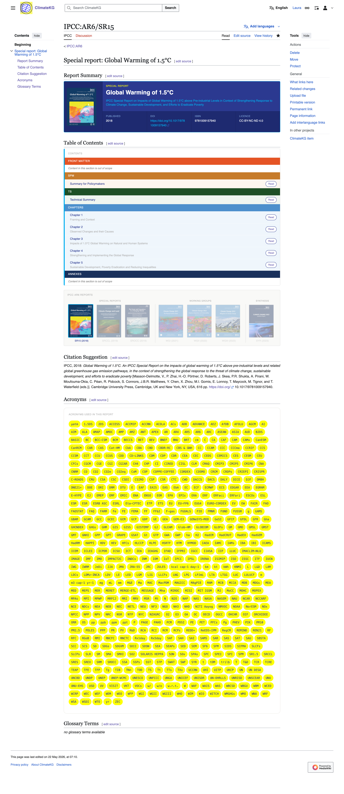

## Slide 1: Title slide {.smaller}

SW

---

## Slide 2: Problem {.smaller}

SW

---

## Slide 3: Source material: What is the IPCC Report {.smaller}

SW

---

## Slide 4: Solution {.smaller}

SW

---

## Slide 5: Siloed Data to FAIR Data - Overview {.smaller}


Text

---

## Slide 6: Scoping Data Source & Data Modeling  {.smaller}

SW

---

## Slide 7: Semi-automated Scrape System from Web to MediaWiki/Wikibase {.smaller}


Text

---

## Slide 8: Collecting Supporting Data {.smaller}


Text

---

## Slide 9: Import Scrape Data  {.smaller}

SW

---

## Slide 10: Import Supporting Data  {.smaller}

SW

---

## Slide 11: Text Corpus in MediaWiki {.smaller}



Text

---

## Slide 12: Output option: CSS Paged media {.smaller}


Text

---

## Slide 13: DevOps {.smaller}

SW

---

## Slide 14:  Data Visualisation {.smaller}

SW

---

## Slide 15: Outlook & Goodbye {.smaller}

SW

---

## Pipeline Stages {.smaller}

*Definitions and tech stack*

| 1\. Authoring | 2\. Production | 3\. Make Book | 4\. Multi-format | 5\. Packaging |
|----|----|----|----|----|
| A. Creating word processor documents<br>B. Creating & using citations<br>C. Computational parts use Jupyter | A. Editorial and production tasks: Review to file revision, etc<br>B. Metadata and PID use | A. Collate ODT files<br>B. Encode and organisation ***Parts of a Book***<br>C. Book configuration | A. Convert to multi-format: PDF, PoD, web, source, etc<br>B. Automatic layout styling<br>C. Preview<br>D. Jupyter Notebooks | A. Store all outputs<br>C. Git versioning<br>D. Public or private<br>D. Website option |
| Word processor TBC; Zotero; Jupyter | Nextcloud: Thoth | *New original software: NCP Make Book* | Quarto / Pandoc; Jupyter | Quarto; GitLab |

::: aside
Parts of a Book. [See Chicago Manual of Style](https://www.chicagomanualofstyle.org/book/ed17/part1/ch01/psec001.html)
:::

::: notes
Use <https://tablegenerator.com/markdown_tables>
:::

## Pipeline Stages and Software {.smaller}


::: notes
```{dot}
//| file: diagrams/data.dot
```
:::

::: aside
Pipeline key: Satges - blue, and; Software - green
:::

## Config File - holds it all together {.smaller}

``` yaml
# A Quarto project configuration file (_quarto.yml)  
project:
  type: book
book:
  title: "Book Title"
  author: "Author Name"
  date: "2026-02-13"
  doi: "10.1234/example.doi"
  chapters:
    - index.qmd
    - data.qmd
    - notebook.ipynb
    - references.qmd
bibliography: references.bib
repositories:
  - name: "Online Book Repository"
    url: "https://gitlab.com/account/repo"
format:
  html:
    theme: cosmo
  pdf:
    documentclass: scrreprt
  epub:
    cover-image: cover.png
```

::: aside
The challenge is how to get all the *Part of a Book* into the [Quarto Book Config file](https://quarto.org/docs/books/#config-file). There will be further configuration files as part of the project, but this Quarto example is as an illustration of the concept.
:::

## 1. Authoring and 2. Production {.smaller}

::::: columns
::: {.column width="50%"}
Word processor and Zotero on Nextcloud. Computational parts are not authored here but integrated at later stage.


:::

::: {.column width="50%"}
Nextcloud allows for editorial and production customisation and flexibility with a suite of productivity tools.


:::
:::::

## 3. Make Book 📕

This is the *new software* being made for the project. Functionalities are:

-   Collate ODT files
-   Citation management
-   Create book settings configuration, inc. Parts of a Book
-   Incorporate book metadata
-   Pass book data to Pandoc (Multi-format-conversion) and Quarto (Packaging)

## 4. Multi-format and 5. Packaging {.smaller}

::::: columns
::: {.column width="50%"}
Quarto and Pandoc are used for automated multi-format conversion and typesetting.


:::

::: {.column width="50%"}
Machine readable storage standard, e.g., [W3C Web Publications](https://www.w3.org/TR/wpub/) and Quarto structure.

``` yaml
#Quarto file structure in a Git repository
mybook/
├─ quarto.yml
├─ chapter1.qmd
├─ chapter2.ipynb
│
├─ notebooks/figures.ipynb
│
├─ data/dataset.csv
│
├─ images/
│
├─ references.bib
│
├─ styles/custom.scss
│
└─ _book/
   ├─ html/index.html
   ├─ pdf/mybook.pdf
   ├─ epub/mybook.epub
   ├─ docx/mybook.docx
   ├─ jats/mybook.xml
   ├─ bits/mybook.xml
   └─ notebooks/mybook.ipynb 
```
:::
:::::

## Publishers Workflow (Sketch)


::: notes
```{dot}
//| file: diagrams/workflow.dot
```
:::

## The New Software - Make Book 📕 {.smaller}

::::: columns
::: {.column width="50%"}
Ideas

-   Using esablished platforms
-   Nextcloud as productivity suite\
-   Using Notebooks allows for computational parts
-   Thoth allows for metamdata distribution
-   Leverage Quarto functionality
-   Concept of packaging from software\
:::

::: {.column width="50%"}
Challenges

-   Reliability of platforms
-   Collating ODT files
-   Collation and citations
-   Citations working
-   Packaging\
-   Testing word processors
-   Work woth Notebook authors
:::
:::::

## Next Stage

Testing book files in the workflow manually to find issues.

Write up schematic and workflow for as a Request for Comment (RFC) to get feedback from the community.