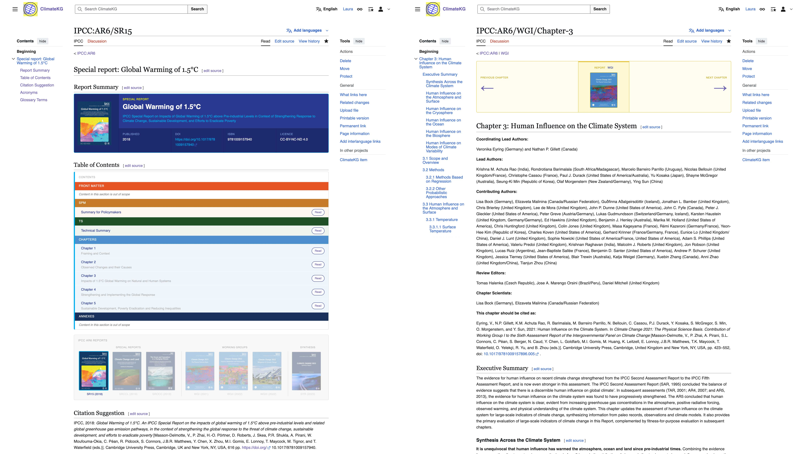

## About ClimateKG {.smaller}

SW

---

## Source material: What is the IPCC Report {.smaller}

SW

## Problem {.smaller}

SW

---

## Solution {.smaller}

SW

---

## Overview of work packages {.smaller}
```{mermaid}
%%| file: diagrams/workflow-overview.mmd
```

• From **Siloed Data** to **FAIR Data**

• **Finding** the sources, **retrieving** the data, **storing** it, preparing different ways of **outputting** and **visualizing** it, and **making it available for reuse**

---

## Scoping Data Source & Data Modeling  {.smaller}

SW

---

## Data Retrieval {.smaller}


• Building a semi-automated scraping system from Web to MediaWiki/Wikibase

• Using the IPCC websites as a starting point, developing a method for scraping text, assets, and additional data

• Preparing the data for import into a MediaWiki/Wikibase instance

---

## Collecting Supporting Data {.smaller}


• Additional data from various sources, e.g. IPCC data repositories, CrossRef, etc.

• Preparing the data for import into Wikibase

---

## Import Scrape Data  {.smaller}

SW

---

## Import Supporting Data  {.smaller}

SW

---

## Browsing the Corpus in MediaWiki {.smaller}



• Cleaning the chapter content directly in MediaWiki

• Adding glossary and acronym content to MediaWiki

• Building navigation and browsing templates for the corpus

---

## Output Option: CSS Paged Media {.smaller}


• One possible output option is using CSS Paged Media to typeset the corpus content into a print-ready format

---

## DevOps {.smaller}

SW

---

## Data Visualisation {.smaller}

SW

---

## Outlook & Goodbye {.smaller}

SW