## About ClimateKG {.smaller}

- Climate Knowledge Graph (ClimateKG) is a yearlong R&D project to create a knowledge&nbsp;graph of the *IPCC Sixth Assement Report (AR6)*.   
- The ClimateKG knowledge graph is built using Wikibase and MediaWiki. 
- The goal is to be a resource for: 
  - data science use, for 
  - citizen science activities, and to 
  - distribute climate science metadata to Wikidata.

The project has been funded by **TIB Innovation Fund** and is made in cooperation with #semanticClimate community (India, Germany, UK, +).     

::: {style="text-align: center; margin-top: 20px;"}

:::

---

## Source Material: What is the IPCC Report? {.smaller}
::: {style="text-align: center;"}
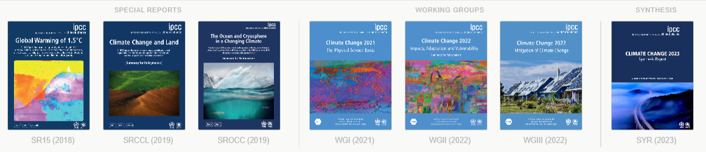 
:::

> It is a survival guide for humanity. As it shows, the 1.5-degree limit is achievable. - [UN Secretary-General António Guterres](https://media.un.org/avlibrary/en/asset/d302/d3022200#:~:text=In%20a%20video%20message%20to,1.5%2Ddegree%20limit%20is%20achievable) (2023)

- A multilateral panel of 195 nations that reviews the global scientific literature to map out climate scenarios for the next 100 years combining science, policy, and politics.
- AR6 ( $\approx$ 5-8 year cycle since 1988): 932 authors; 7 Reports; >8 million words; 10,047 pages; 48,400 citations; 66,834 data sets; 2,136 images; 1,910 Acronyms; 920 Glossary items; 5 languages+ (partial).* 

::: aside
\* Oldenbourg, Laura, and Simon Worthington. "IPCC AR6 Quantification Summary". Climate Knowledge Graph, November 4, 2025. [10.5281/zenodo.17521936](https://doi.org/10.5281/zenodo.17521936).
:::

## ClimateKG Project Deliverables{.smaller}

::: {style="text-align: center;"}
Transform PDF and web corpus, and web databases into a knowledge graph with:
:::

::: {style="display: grid; grid-template-columns: 1fr 1fr 1fr; grid-template-rows: auto auto; gap: 20px; margin-top: 20px;"}
::: {style="grid-column: 1; grid-row: 1; text-align: center;"}
<!-- Cell 1,1 - Add content here --> [Full text](https://prod-climatekg.semanticclimate.org/wiki/IPCC:AR6) & [publishing](https://vivliostyle.vercel.app/#src=https://github.com/TIBHannover/climate-knowledge-graph/blob/main/design_pattern/sample-chapter/chapter.json&style=https://github.com/TIBHannover/climate-knowledge-graph/blob/main/design_pattern/sample-chapter/css-neutral/styles.css) 
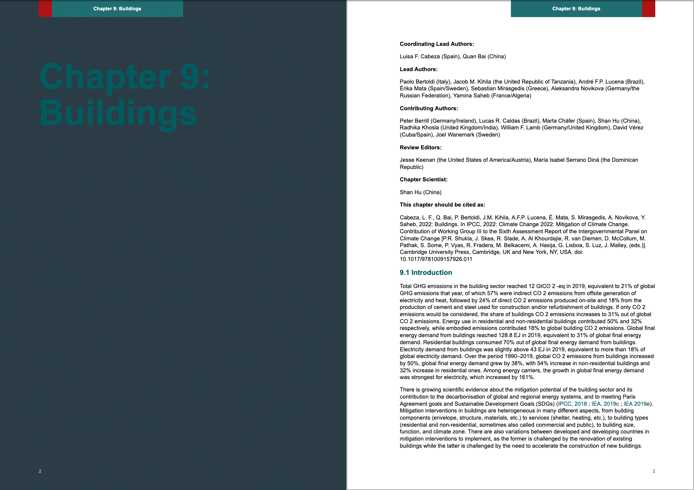 
:::

::: {style="grid-column: 2; grid-row: 1; text-align: center;"}
<!-- Cell 1,2 - Add content here -->[Metadata](https://prod-climatekg.semanticclimate.org/wiki/Item:Q106)

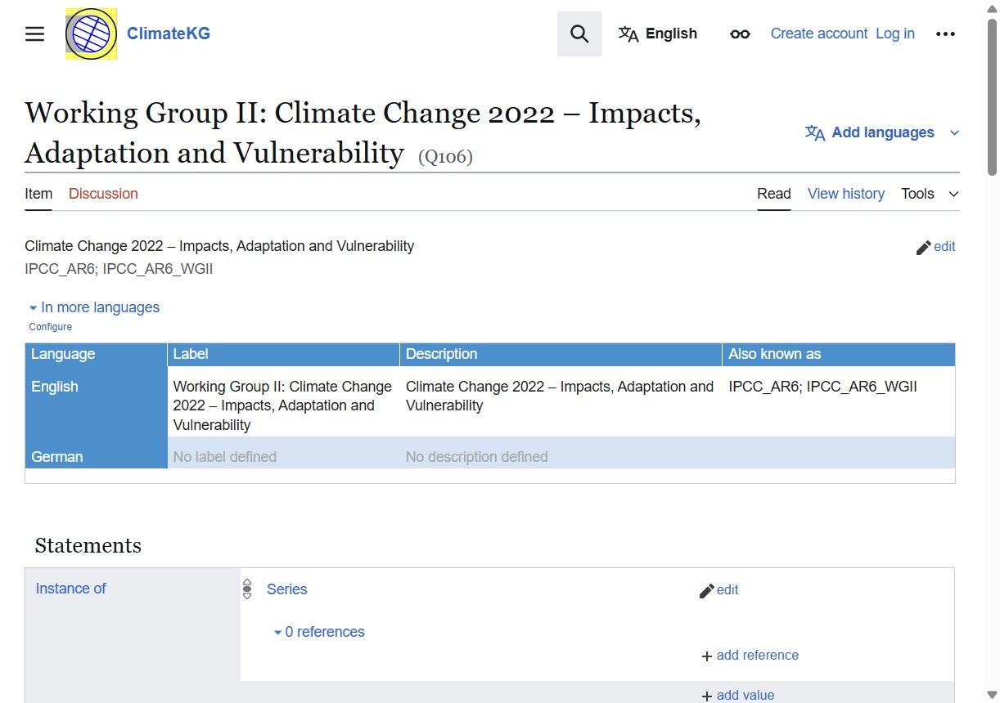 
:::

::: {style="grid-column: 3; grid-row: 1; text-align: center;"}
<!-- Cell 1,3 - Add content here -->[API](https://prod-climatekg.semanticclimate.org/api.php) / [SPARQL Endpoint](https://prod-climatekg.semanticclimate.org/query/#%23defaultView%3AGraph%0ASELECT%20%3Fchapter%20%3FchapterLabel%20%3Frelated%20%3FrelatedLabel%0AWHERE%20%7B%0A%20%20%3Fchapter%20%3Chttps%3A%2F%2Fprod-climatekg.semanticclimate.org%2Fprop%2Fdirect%2FP3%3E%20%3Chttps%3A%2F%2Fprod-climatekg.semanticclimate.org%2Fentity%2FQ110%3E%20.%0A%20%20%3Fchapter%20%3Chttps%3A%2F%2Fprod-climatekg.semanticclimate.org%2Fprop%2Fdirect%2FP12%3E%20%3Frelated%20.%0A%20%20SERVICE%20wikibase%3Alabel%20%7B%20bd%3AserviceParam%20wikibase%3Alanguage%20%22en%22.%20%7D%0A%7D)

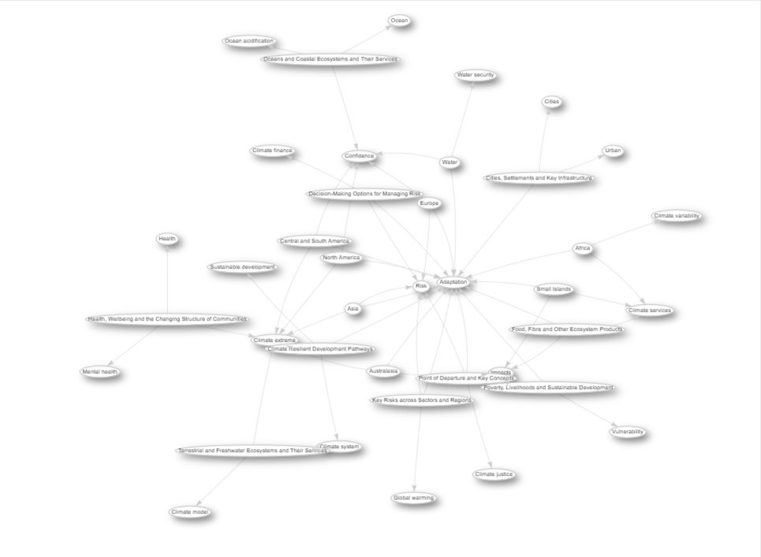 

:::

::: {style="grid-column: 1; grid-row: 2; text-align: center;"}
<!-- Cell 2,1 - Add content here -->Data dump
:::

::: {style="grid-column: 2; grid-row: 2; text-align: center;"}
<!-- Cell 2,2 - Add content here -->Schemas / Ontologies: Datacite, OpenAlex, BFO, etc
:::

::: {style="grid-column: 3; grid-row: 2; text-align: center;"}
<!-- Cell 2,3 - Add content here -->Data workbench: JupyterLab / Quarto
:::
:::  

---

## Problem: For the public to trust climate science it has at their fingertips {.smaller}

::::: columns
::: {.column width="50%"}
- **Headline issues:**
  - Search and SEO limited
  - Not easy to reuse
  - Formats of Web CMS HTML and PDF not suitable for data science
  - Referenced materials not interlinked - so only manual tracking to find a named data set, etc
  - Parts not easily available - Methodology, Supplementary material

:::

::: {.column width="50%"}
- **Examples:**
  - Links only to top levels: Reports, Glossary website, Author listing website etc.
  - Glossary terms have no links to reports
  - Author lists have no link to chapters
  - Figures listed on web pages with no DOIs
  - Citations on websites and not research repositories

:::
:::::

::: aside
Example IPCC sites: [Reports](https://www.ipcc.ch/assessment-report/ar6/); [Authors](https://apps.ipcc.ch/report/authors/); [Glossary](https://apps.ipcc.ch/glossary/); [Figures and Citations example WGIII](https://www.ipcc.ch/report/ar6/wg3/).
:::

---

## Solution: Apply the vision of the Semantic Web 🕸️ 

> Link all of the parts and make machine readable — AKA a Knowledge Graph 

- **Linked Data**: Interlinked data with unique identifiers and standard formats
- **FAIR Data**: Findable, Accessible, Interoperable, and Reusable

---

## Overview of work packages 📦 {.smaller}

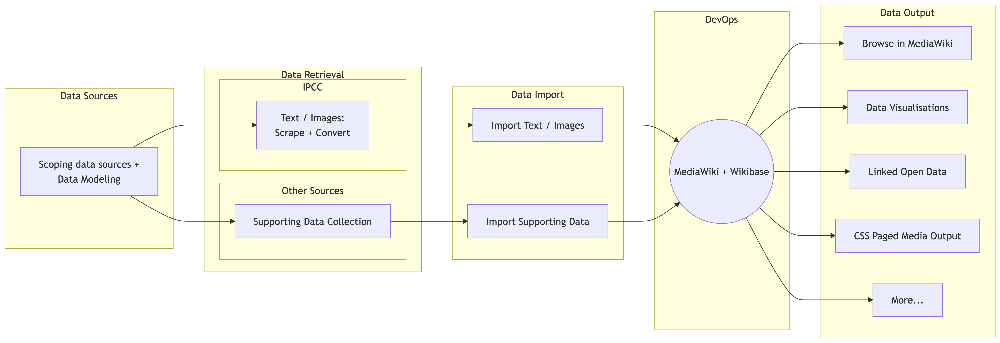

- From **Siloed Data** to **FAIR Data**

- **Finding** the sources, **retrieving** the data, **storing** it, preparing different ways of **outputting** and **visualizing** it, and **making it available for reuse**

---

## Scoping Data Sources & Data Modeling  {.smaller}

- In-scope and out-of-scope: Only the main text for AR6 has been currently imported, also citatations and data sets have not been linked.
- Data modelling:
  - Simple (KISS) approaches of Genome Bank and Protein Data Bank have been used to encourage community uptake.
  - Method: Bottom up / Top down / and map to schemas
  - Lit review of Wikibase KGs consulted - [[Zotero collection]](https://www.zotero.org/groups/2437020/semanticclimate/collections/IXBQXNLH/tags/kg%20litreview%20must%20read/collection) 

::: aside
Wikibase KG literature: Disability Wiki; EU Knowledge Graph; Enslaved.Org; Enslave Modular Ontology Modeling (MOMo); RaiseWikibase; Linking Historical Corpus Data and Annotations Using Wikibase (1737 Basque manuscript).    
:::  

---

## Data Retrieval 📥 {.smaller}

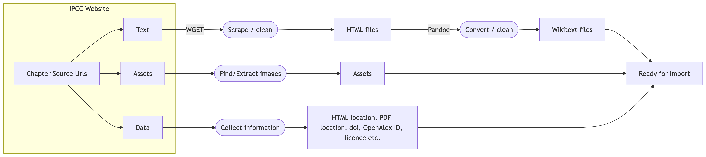

• Building a **semi-automated scraping system** from Web to MediaWiki/Wikibase

• Using the IPCC websites as a starting point, developing a method for scraping **text**, **assets**, and **additional data**

• Preparing the data for **import into a MediaWiki/Wikibase instance**

---

## Collecting Supporting Data 📥 {.smaller}

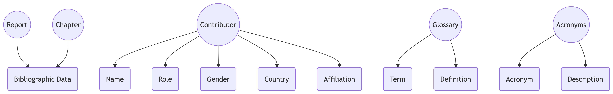

• **Additional data** from **various sources**, e.g. IPCC data repositories, CrossRef, etc.

• Preparing the data for **import into Wikibase**

---

## Import Scrape Data - Innovation that allows for Corpus text and data import {.smaller}

This is the main innovation of the project - being able to semi-automatically webscrape a corpus and import text and images, and make a Linked Open Data corpus backbone as an Import to Wikibase and MediaWiki.

Wikitext + CSV > XML > DTD > Python (WikibaseIntegrator) > Wikibase / MediaWiki

Documentation: [wiki.kewl.org/projects:ckgscrape](https://wiki.kewl.org/projects:ckgscrape) 

Code: Mercurial Clone `hg clone https://hg.kewl.org/pub/ckg_s2mw`

Thank you to Darron M. Broad of Runstop for the software development work.

---

## Import Supporting Data  {.smaller}

::::: columns
::: {.column width="30%"}
```{mermaid}
%%{init: {'theme':'base', 'themeVariables': { 'primaryColor':'#f0f0f0', 'primaryTextColor':'#000', 'primaryBorderColor':'#000', 'lineColor':'#666', 'fontSize':'18px'}, 'flowchart': {'nodeSpacing': 20, 'rankSpacing': 25, 'padding': 35, 'htmlLabels': true}}}%%
flowchart TD
    A[CSV] --> B[XML]
    B --> C[DTD]
    C --> D[Schemas]
    D --> E[Python<br/>WikibaseIntegrator]
    E --> F[Wikibase]
    
    style A min-width:150px
    style B min-width:150px
    style C min-width:150px
    style D min-width:150px
    style E min-width:250px
    style F min-width:150px
```
:::

::: {.column width="70%"}
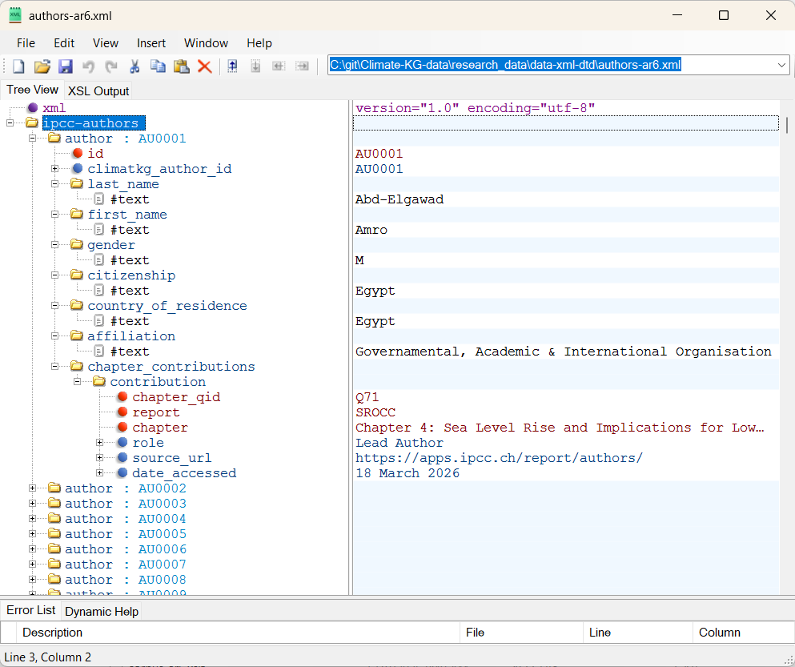

:::
::::: 

::: aside
Data can be browsed as XML and XSLT transforms here: [ClimateKG Data](https://tibhannover.github.io/Climate-KG-data/xml-html-documentation.html) (See menu item: Data Documentation)   
:::  


---

## Browsing the Corpus in MediaWiki 🔎 {.smaller}

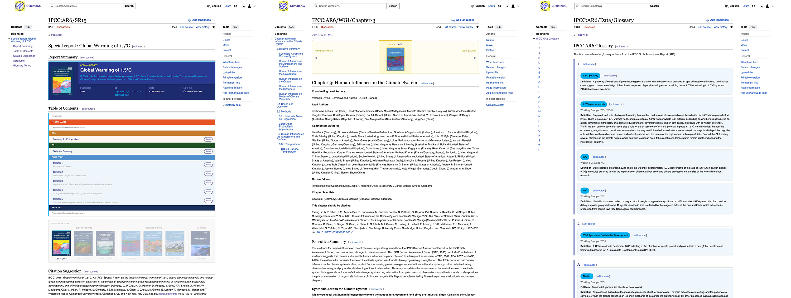

• **Cleaning** the chapter content directly in MediaWiki

• **Adding glossary and acronym content** to MediaWiki

• Building **navigation and browsing templates** for the corpus

---

## DevOps {.smaller}

A 4 stage MediaWiki/Wikibase deployment is in place with support from #semanticClimate - this will move to TIB hosting shortly once initial development resolved.

```
DATABASE/CONTENT FLOW (via sync scripts):
┌──────────────┐                    ┌──────────────┐
│   LOCAL      │◄───pull-from-dev───│     DEV      │  DEV = DB source of truth
│ (workstation)│                    │ (178...88)   │  Content edited here
└──────┬───────┘                    └──────┬───────┘
       │                                   │
       │ sync-local-to-test                │ sync-dev-to-test
       │ (staging from local)              │ (standard promotion)
       │                                   │
       ↓                                   ↓
   ┌──────────────┐                  ┌──────────────┐
   │    TEST      │──────────────────│    TEST      │
   │ (46...24)    │  (same target)   │ (46...24)    │
   └──────────────┘                  └──────┬───────┘
                                            │
                                            │ sync-dev-to-prod  (or sync-test-to-prod)
                                            │
                                            ↓
                                       ┌──────────────┐
                                       │    PROD      │  Public instance
                                       │ (178...174)  │
                                       └──────────────┘
```

---

## Data Analysis & Visualisation {.smaller}

::::: columns
::: {.column width="50%"}
### Gender Equality
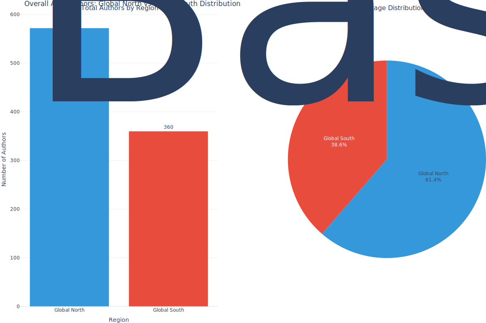

:::

::: {.column width="50%"}
### Data Dashboard
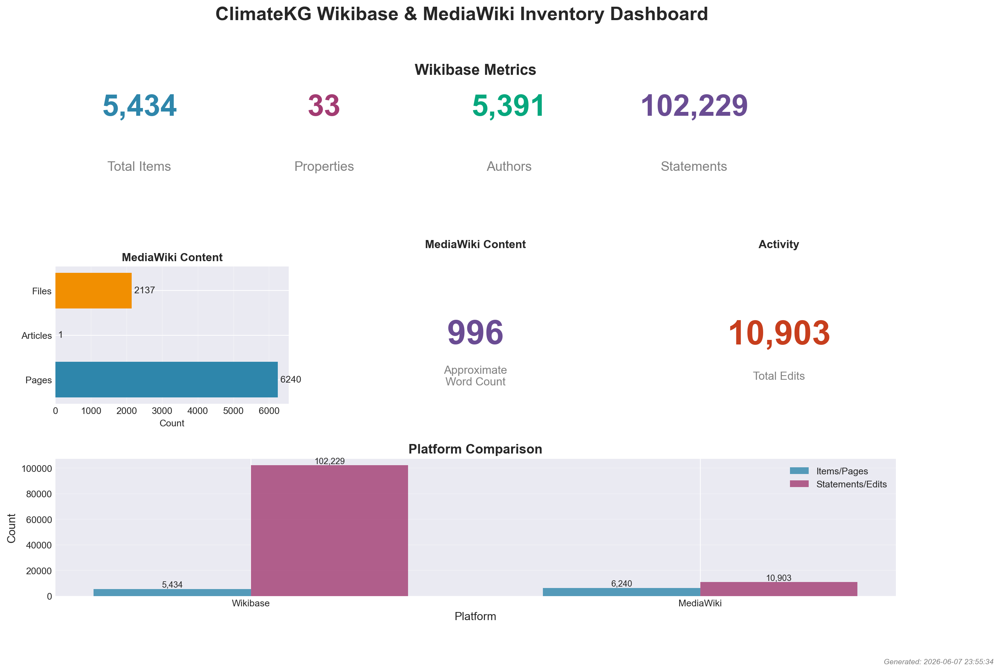

:::
:::::

::: aside
Generated direct from Wikibase KG using Python, Notebooks, and Quarto: [tibhannover.github.io/Climate-KG-data/](https://tibhannover.github.io/Climate-KG-data/)
:::

---

## Output Option: CSS Paged Media 📖 {.smaller}

::::: columns
::: {.column width="60%"}
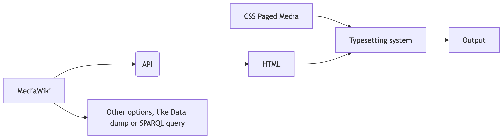
:::

::: {.column width="40%"}

:::
:::::

• One possible **output option**: using **CSS Paged Media** to typeset the corpus content into a **print-ready format**

--- 

## ClimateKG Next Steps 🚀 {.smaller}

### Planned use: 

- A resource for data science — to use and contribute
- Citizen science activities — Chapter annotation and enrichment 
-  Distribute to commons (Wikidata)  

### Goals:

- Corpus KG service — Computation Publishing Service (CPS)
- Work with IPCC and climate community
- Become a KG repository for *all* climate literature

*Thank you! Simon Worthington, Laura Oldenbourg, and team #semanticClimate — June '26* 

::: aside
Main </> repo: [github.com/TIBHannover/climate-knowledge-graph](https://github.com/TIBHannover/climate-knowledge-graph)
:::